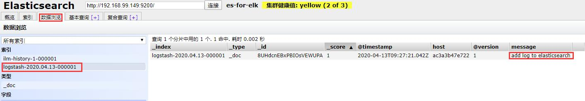

# elk
elasticsearch + logstash + kibaba  
分布式日志实时收集过滤分析系统  

参考  
https://www.cnblogs.com/cheyunhua/p/11238489.html  

## 搭建过程
以下为centos系统环境下的搭建过程  
   
### elasticsearch
https://www.elastic.co/guide/en/elasticsearch/reference/7.6/rpm.html#rpm-repo  
```shell script
rpm --import https://artifacts.elastic.co/GPG-KEY-elasticsearch
echo -e '
[elasticsearch]
name=Elasticsearch repository for 7.x packages
baseurl=https://artifacts.elastic.co/packages/7.x/yum
gpgcheck=1
gpgkey=https://artifacts.elastic.co/GPG-KEY-elasticsearch
enabled=0
autorefresh=1
type=rpm-md
' > /etc/yum.repos.d/elasticsearch.repo
yum -y install --enablerepo=elasticsearch elasticsearch

echo -e '
# ======================== Elasticsearch Configuration =========================
#
# NOTE: Elasticsearch comes with reasonable defaults for most settings.
#       Before you set out to tweak and tune the configuration, make sure you
#       understand what are you trying to accomplish and the consequences.
#
# The primary way of configuring a node is via this file. This template lists
# the most important settings you may want to configure for a production cluster.
#
# Please consult the documentation for further information on configuration options:
# https://www.elastic.co/guide/en/elasticsearch/reference/index.html
#
# ---------------------------------- Cluster -----------------------------------
#
# Use a descriptive name for your cluster:
#
cluster.name: es-for-elk
#
# ------------------------------------ Node ------------------------------------
#
# Use a descriptive name for the node:
#
node.master: true
node.data: true
node.name: es-node-0
#
# Add custom attributes to the node:
#
#node.attr.rack: r1
#
# ----------------------------------- Paths ------------------------------------
#
# Path to directory where to store the data (separate multiple locations by comma):
#
path.data: /var/lib/elasticsearch
#
# Path to log files:
#
path.logs: /var/log/elasticsearch
#
# ----------------------------------- Memory -----------------------------------
#
# Lock the memory on startup:
#
#bootstrap.memory_lock: true
#
# Make sure that the heap size is set to about half the memory available
# on the system and that the owner of the process is allowed to use this
# limit.
#
# Elasticsearch performs poorly when the system is swapping the memory.
#
# ---------------------------------- Network -----------------------------------
#
# Set the bind address to a specific IP (IPv4 or IPv6):
#
network.host: 0.0.0.0
#
# Set a custom port for HTTP:
#
http.port: 9200
http.cors.enabled: true
http.cors.allow-origin: "*"
#
# For more information, consult the network module documentation.
#
# --------------------------------- Discovery ----------------------------------
#
# Pass an initial list of hosts to perform discovery when this node is started:
# The default list of hosts is ["127.0.0.1", "[::1]"]
#
discovery.seed_hosts: ["127.0.0.1"]
#
# Bootstrap the cluster using an initial set of master-eligible nodes:
#
cluster.initial_master_nodes: ["es-node-0"]
#
# For more information, consult the discovery and cluster formation module documentation.
#
# ---------------------------------- Gateway -----------------------------------
#
# Block initial recovery after a full cluster restart until N nodes are started:
#
#gateway.recover_after_nodes: 3
#
# For more information, consult the gateway module documentation.
#
# ---------------------------------- Various -----------------------------------
#
# Require explicit names when deleting indices:
#
#action.destructive_requires_name: true
' > /etc/elasticsearch/elasticsearch.yml

# 设置开机启动
systemctl enable elasticsearch
# 启动
systemctl start elasticsearch
# 如果启动失败，查看 /var/log/elasticsearch/es-for-elk.log 
# 停止
# systemctl stop elasticsearch
```
然后在浏览器中可通过  
http://IP:9200/  
得到如下输出  
```
{
  "name" : "es-node-0",
  "cluster_name" : "es-for-elk",
  "cluster_uuid" : "_na_",
  "version" : {
    "number" : "7.6.2",
    "build_flavor" : "default",
    "build_type" : "rpm",
    "build_hash" : "ef48eb35cf30adf4db14086e8aabd07ef6fb113f",
    "build_date" : "2020-03-26T06:34:37.794943Z",
    "build_snapshot" : false,
    "lucene_version" : "8.4.0",
    "minimum_wire_compatibility_version" : "6.8.0",
    "minimum_index_compatibility_version" : "6.0.0-beta1"
  },
  "tagline" : "You Know, for Search"
}
```

### elasticsearch-head
es可视化辅助工具    
```shell script
curl -sL https://rpm.nodesource.com/setup_10.x | bash - \
    && yum -y install nodejs
mkdir -p /data/
git clone git://github.com/mobz/elasticsearch-head.git
cd elasticsearch-head
npm install
nohup npm run start &
```
然后在浏览器中可通过  
http://IP:9100/  

### logstash
https://www.elastic.co/guide/en/logstash/7.6/installing-logstash.html#_yum  
```shell script
echo -e '
[logstash-7.x]
name=Elastic repository for 7.x packages
baseurl=https://artifacts.elastic.co/packages/7.x/yum
gpgcheck=1
gpgkey=https://artifacts.elastic.co/GPG-KEY-elasticsearch
enabled=1
autorefresh=1
type=rpm-md
' > /etc/yum.repos.d/logstash.repo
yum -y install logstash
ln -s /usr/share/logstash/bin/logstash /bin/
```

测试  
```shell script
echo "just test" > test.txt
logstash -e 'input { stdin { } } output { stdout {} }' < test.txt
```
输出日志最后可以看到  
```
{
      "@version" => "1",
    "@timestamp" => 2020-04-13T09:02:00.560Z,
       "message" => "just test",
          "host" => "ac3a3b47e722"
}
```

测试 elasticsearch 联动  
```shell script
echo "add log to elasticsearch" > test.txt
logstash -e 'input { stdin { } } output { elasticsearch { hosts => ["127.0.0.1:9200"] } stdout { codec => rubydebug }}' < test.txt
```
输出日志最后可以看到  
```
{
    "@timestamp" => 2020-04-13T09:27:21.042Z,
          "host" => "ac3a3b47e722",
      "@version" => "1",
       "message" => "add log to elasticsearch"
}
```
然后在 elasticsearch-head 中可以看到记录  


### kibana
https://www.elastic.co/guide/en/kibana/7.6/rpm.html#rpm-repo  
```shell script
echo -e '
[kibana-7.x]
name=Kibana repository for 7.x packages
baseurl=https://artifacts.elastic.co/packages/7.x/yum
gpgcheck=1
gpgkey=https://artifacts.elastic.co/GPG-KEY-elasticsearch
enabled=1
autorefresh=1
type=rpm-md
' > /etc/yum.repos.d/kibana.repo
yum -y install kibana

# 设置开机启动
systemctl enable kibana
# 启动
systemctl start kibana
# 停止
# systemctl stop kibana
```
