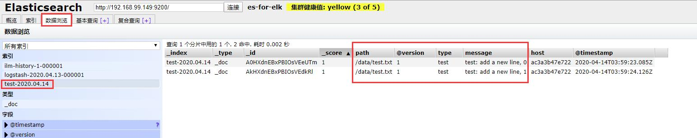
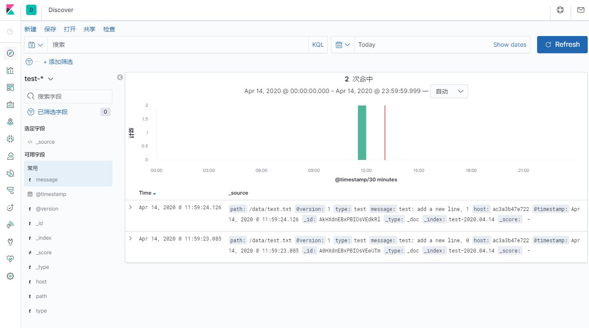
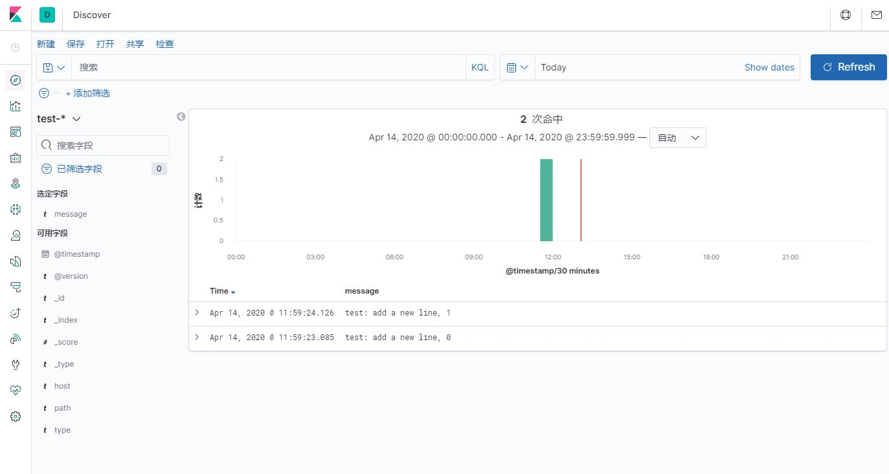
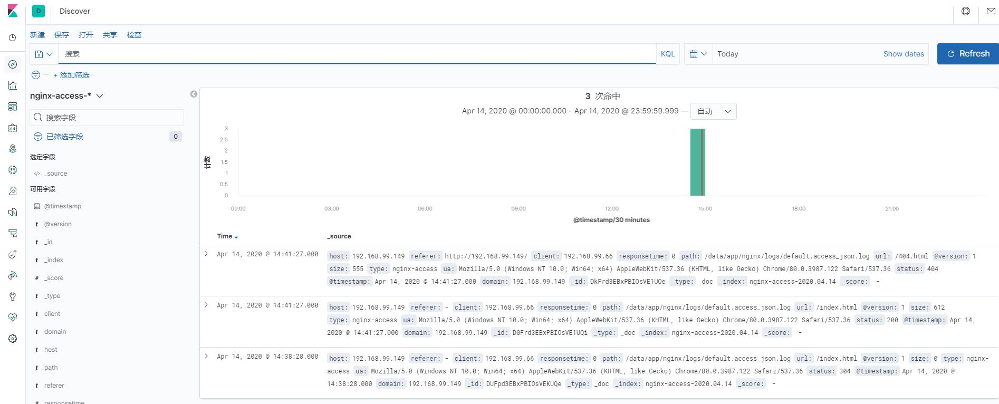

# elk
elasticsearch + logstash + kibaba  
分布式日志实时收集过滤分析系统  

参考  
https://www.cnblogs.com/cheyunhua/p/11238489.html  

## 搭建过程
以下为centos7系统环境下的搭建过程  
   
### elasticsearch
https://www.elastic.co/guide/en/elasticsearch/reference/7.6/rpm.html#rpm-repo  
```shell script
rpm --import https://artifacts.elastic.co/GPG-KEY-elasticsearch
echo -e '
[elasticsearch]
name=Elasticsearch repository for 7.x packages
baseurl=https://artifacts.elastic.co/packages/7.x/yum
gpgcheck=1
gpgkey=https://artifacts.elastic.co/GPG-KEY-elasticsearch
enabled=0
autorefresh=1
type=rpm-md
' > /etc/yum.repos.d/elasticsearch.repo
yum -y install --enablerepo=elasticsearch elasticsearch

echo -e '
# ======================== Elasticsearch Configuration =========================
#
# NOTE: Elasticsearch comes with reasonable defaults for most settings.
#       Before you set out to tweak and tune the configuration, make sure you
#       understand what are you trying to accomplish and the consequences.
#
# The primary way of configuring a node is via this file. This template lists
# the most important settings you may want to configure for a production cluster.
#
# Please consult the documentation for further information on configuration options:
# https://www.elastic.co/guide/en/elasticsearch/reference/index.html
#
# ---------------------------------- Cluster -----------------------------------
#
# Use a descriptive name for your cluster:
#
cluster.name: es-for-elk
#
# ------------------------------------ Node ------------------------------------
#
# Use a descriptive name for the node:
#
node.master: true
node.data: true
node.name: es-node-0
#
# Add custom attributes to the node:
#
#node.attr.rack: r1
#
# ----------------------------------- Paths ------------------------------------
#
# Path to directory where to store the data (separate multiple locations by comma):
#
path.data: /var/lib/elasticsearch
#
# Path to log files:
#
path.logs: /var/log/elasticsearch
#
# ----------------------------------- Memory -----------------------------------
#
# Lock the memory on startup:
#
#bootstrap.memory_lock: true
#
# Make sure that the heap size is set to about half the memory available
# on the system and that the owner of the process is allowed to use this
# limit.
#
# Elasticsearch performs poorly when the system is swapping the memory.
#
# ---------------------------------- Network -----------------------------------
#
# Set the bind address to a specific IP (IPv4 or IPv6):
#
network.host: 0.0.0.0
#
# Set a custom port for HTTP:
#
http.port: 9200
http.cors.enabled: true
http.cors.allow-origin: "*"
#
# For more information, consult the network module documentation.
#
# --------------------------------- Discovery ----------------------------------
#
# Pass an initial list of hosts to perform discovery when this node is started:
# The default list of hosts is ["127.0.0.1", "[::1]"]
#
discovery.seed_hosts: ["127.0.0.1"]
#
# Bootstrap the cluster using an initial set of master-eligible nodes:
#
cluster.initial_master_nodes: ["es-node-0"]
#
# For more information, consult the discovery and cluster formation module documentation.
#
# ---------------------------------- Gateway -----------------------------------
#
# Block initial recovery after a full cluster restart until N nodes are started:
#
#gateway.recover_after_nodes: 3
#
# For more information, consult the gateway module documentation.
#
# ---------------------------------- Various -----------------------------------
#
# Require explicit names when deleting indices:
#
#action.destructive_requires_name: true
' > /etc/elasticsearch/elasticsearch.yml

# 设置开机启动
systemctl enable elasticsearch
# 启动
systemctl start elasticsearch
# 如果启动失败，查看 /var/log/elasticsearch/es-for-elk.log 
# 停止
# systemctl stop elasticsearch
```
然后在浏览器中可通过  
http://IP:9200/  
得到如下输出  
```
{
  "name" : "es-node-0",
  "cluster_name" : "es-for-elk",
  "cluster_uuid" : "_na_",
  "version" : {
    "number" : "7.6.2",
    "build_flavor" : "default",
    "build_type" : "rpm",
    "build_hash" : "ef48eb35cf30adf4db14086e8aabd07ef6fb113f",
    "build_date" : "2020-03-26T06:34:37.794943Z",
    "build_snapshot" : false,
    "lucene_version" : "8.4.0",
    "minimum_wire_compatibility_version" : "6.8.0",
    "minimum_index_compatibility_version" : "6.0.0-beta1"
  },
  "tagline" : "You Know, for Search"
}
```

### elasticsearch-head
es可视化辅助工具    
```shell script
curl -sL https://rpm.nodesource.com/setup_10.x | bash - \
    && yum -y install nodejs
mkdir -p /data/
git clone git://github.com/mobz/elasticsearch-head.git
cd elasticsearch-head
npm install
nohup npm run start &
```
然后在浏览器中可通过  
http://IP:9100/  

### logstash
https://www.elastic.co/guide/en/logstash/7.6/installing-logstash.html#_yum  
```shell script
echo -e '
[logstash-7.x]
name=Elastic repository for 7.x packages
baseurl=https://artifacts.elastic.co/packages/7.x/yum
gpgcheck=1
gpgkey=https://artifacts.elastic.co/GPG-KEY-elasticsearch
enabled=1
autorefresh=1
type=rpm-md
' > /etc/yum.repos.d/logstash.repo
yum -y install logstash
ln -s /usr/share/logstash/bin/logstash /bin/
```

测试  
```shell script
echo "just test" > test.txt
logstash -e 'input { stdin { } } output { stdout {} }' < test.txt
```
输出日志最后可以看到  
```
{
      "@version" => "1",
    "@timestamp" => 2020-04-13T09:02:00.560Z,
       "message" => "just test",
          "host" => "ac3a3b47e722"
}
```

测试 elasticsearch 联动  
```shell script
echo "add log to elasticsearch" > test.txt
logstash -e 'input { stdin { } } output { elasticsearch { hosts => ["127.0.0.1:9200"] } stdout { codec => rubydebug }}' < test.txt
```
输出日志最后可以看到  
```
{
    "@timestamp" => 2020-04-13T09:27:21.042Z,
          "host" => "ac3a3b47e722",
      "@version" => "1",
       "message" => "add log to elasticsearch"
}
```
然后在 elasticsearch-head 中可以看到记录(一次运行没有看到数据就再运行一次上面的测试命令)    
  

修改配置，让 logstash 作为服务运行    
```shell script
# 安装jdk(略)
# /etc/logstash/startup.options 中的默认配置 JAVACMD=/usr/bin/java，如果这个可执行文件不存在，我们自己创建一个软链接指向已安装的java路径 
if [ ! -f "/usr/bin/java" ]; then 
    ln -s $(whereis java | awk '{print $2}') /usr/bin/
fi

mkdir /data
touch /data/test.txt

cat > /etc/logstash/conf.d/elk.conf << 'EOF'
input {
    file {
        path => "/data/test.txt"
        type => "test"
        start_position => "beginning"
        codec => plain {
            charset=>"UTF-8"
        }
    }
}

output {
    if [type] == "test" {
        elasticsearch {
            hosts => ["localhost:9200"]
            index => "test-%{+YYYY.MM.dd}"
        }
    }
}
EOF

/usr/share/logstash/bin/system-install
systemctl enable logstash
systemctl start logstash
# 查看启动是否成功
systemctl status logstash
# 如果启动失败，可以查看日志  
# tail -1024f /var/log/logstash/logstash-plain.log

# 向 /data/test.txt 写入新内容，模拟日志写入  
echo "test: add a new line, 0" >> /data/test.txt
echo "test: add a new line, 1" >> /data/test.txt
```
可以在 elasticsearch-head 中查询到新添加的记录  
  
可以将需要收集分析的日志文件加入到 /etc/logstash/conf.d/elk.conf 配置中即可  

### kibana
https://www.elastic.co/guide/en/kibana/7.6/rpm.html#rpm-repo  
```shell script
echo -e '
[kibana-7.x]
name=Kibana repository for 7.x packages
baseurl=https://artifacts.elastic.co/packages/7.x/yum
gpgcheck=1
gpgkey=https://artifacts.elastic.co/GPG-KEY-elasticsearch
enabled=1
autorefresh=1
type=rpm-md
' > /etc/yum.repos.d/kibana.repo
yum -y install kibana

# 修改配置
cat > /etc/kibana/kibana.yml << 'EOF'
# Kibana is served by a back end server. This setting specifies the port to use.
server.port: 5601

# Specifies the address to which the Kibana server will bind. IP addresses and host names are both valid values.
server.host: "0.0.0.0"

# Enables you to specify a path to mount Kibana at if you are running behind a proxy.
# Use the `server.rewriteBasePath` setting to tell Kibana if it should remove the basePath
# from requests it receives, and to prevent a deprecation warning at startup.
# This setting cannot end in a slash.
#server.basePath: ""

# Specifies whether Kibana should rewrite requests that are prefixed with
# `server.basePath` or require that they are rewritten by your reverse proxy.
# This setting was effectively always `false` before Kibana 6.3 and will
# default to `true` starting in Kibana 7.0.
#server.rewriteBasePath: false

# The maximum payload size in bytes for incoming server requests.
#server.maxPayloadBytes: 1048576

# The Kibana server's name.  This is used for display purposes.
#server.name: "your-hostname"

# The URLs of the Elasticsearch instances to use for all your queries.
elasticsearch.hosts: ["http://localhost:9200"]

# When this setting's value is true Kibana uses the hostname specified in the server.host
# setting. When the value of this setting is false, Kibana uses the hostname of the host
# that connects to this Kibana instance.
#elasticsearch.preserveHost: true

# Kibana uses an index in Elasticsearch to store saved searches, visualizations and
# dashboards. Kibana creates a new index if the index doesn`t already exist.
kibana.index: ".kibana"

# The default application to load.
#kibana.defaultAppId: "home"

# If your Elasticsearch is protected with basic authentication, these settings provide
# the username and password that the Kibana server uses to perform maintenance on the Kibana
# index at startup. Your Kibana users still need to authenticate with Elasticsearch, which
# is proxied through the Kibana server.
#elasticsearch.username: "kibana"
#elasticsearch.password: "pass"

# Enables SSL and paths to the PEM-format SSL certificate and SSL key files, respectively.
# These settings enable SSL for outgoing requests from the Kibana server to the browser.
#server.ssl.enabled: false
#server.ssl.certificate: /path/to/your/server.crt
#server.ssl.key: /path/to/your/server.key

# Optional settings that provide the paths to the PEM-format SSL certificate and key files.
# These files are used to verify the identity of Kibana to Elasticsearch and are required when
# xpack.security.http.ssl.client_authentication in Elasticsearch is set to required.
#elasticsearch.ssl.certificate: /path/to/your/client.crt
#elasticsearch.ssl.key: /path/to/your/client.key

# Optional setting that enables you to specify a path to the PEM file for the certificate
# authority for your Elasticsearch instance.
#elasticsearch.ssl.certificateAuthorities: [ "/path/to/your/CA.pem" ]

# To disregard the validity of SSL certificates, change this setting's value to "none".
#elasticsearch.ssl.verificationMode: full

# Time in milliseconds to wait for Elasticsearch to respond to pings. Defaults to the value of
# the elasticsearch.requestTimeout setting.
#elasticsearch.pingTimeout: 1500

# Time in milliseconds to wait for responses from the back end or Elasticsearch. This value
# must be a positive integer.
#elasticsearch.requestTimeout: 30000

# List of Kibana client-side headers to send to Elasticsearch. To send *no* client-side
# headers, set this value to [] (an empty list).
#elasticsearch.requestHeadersWhitelist: [ authorization ]

# Header names and values that are sent to Elasticsearch. Any custom headers cannot be overwritten
# by client-side headers, regardless of the elasticsearch.requestHeadersWhitelist configuration.
#elasticsearch.customHeaders: {}

# Time in milliseconds for Elasticsearch to wait for responses from shards. Set to 0 to disable.
#elasticsearch.shardTimeout: 30000

# Time in milliseconds to wait for Elasticsearch at Kibana startup before retrying.
#elasticsearch.startupTimeout: 5000

# Logs queries sent to Elasticsearch. Requires logging.verbose set to true.
#elasticsearch.logQueries: false

# Specifies the path where Kibana creates the process ID file.
#pid.file: /var/run/kibana.pid

# Enables you specify a file where Kibana stores log output.
#logging.dest: stdout

# Set the value of this setting to true to suppress all logging output.
#logging.silent: false

# Set the value of this setting to true to suppress all logging output other than error messages.
#logging.quiet: false

# Set the value of this setting to true to log all events, including system usage information
# and all requests.
#logging.verbose: false

# Set the interval in milliseconds to sample system and process performance
# metrics. Minimum is 100ms. Defaults to 5000.
#ops.interval: 5000

# Specifies locale to be used for all localizable strings, dates and number formats.
# Supported languages are the following: English - en , by default , Chinese - zh-CN .
#i18n.locale: "zh-CN"
EOF

# 设置开机启动
systemctl enable kibana
# 启动
systemctl start kibana
# 停止
# systemctl stop kibana
```

启动后，稍等几秒钟，等待 kibana 完全启动成功，浏览器访问   
http://IP:5601/app/kibana  
  
  
  
  
  

## elk 分析 nginx 流量  
安装 nginx  
```shell script
rpm -Uvh http://nginx.org/packages/centos/7/noarch/RPMS/nginx-release-centos-7-0.el7.ngx.noarch.rpm
# 安装
yum -y install nginx

# 创建文件夹用于存放配置，静态文件，证书，日志文件夹
mkdir -p /data/app/nginx/static
mkdir -p /data/app/nginx/config
mkdir -p /data/app/nginx/ssl
mkdir -p /data/app/nginx/logs

cat > /etc/nginx/nginx.conf << 'EOF'
# For more information on configuration, see:
#   * Official English Documentation: http://nginx.org/en/docs/
#   * Official Russian Documentation: http://nginx.org/ru/docs/

user root;
worker_processes auto;
error_log /data/app/nginx/logs/error.log;
pid /data/app/nginx/nginx.pid;

# Load dynamic modules. See /usr/share/doc/nginx/README.dynamic.
include /usr/share/nginx/modules/*.conf;

events {
    worker_connections 1024;
}

http {
    log_format  main  '$remote_addr - $remote_user [$time_local] "$request" '
    '$status $body_bytes_sent "$http_referer" '
    '"$http_user_agent" "$http_x_forwarded_for"';

    log_format lf_access_json '{"@timestamp":"$time_iso8601",'
        '"@version":"1",'
        '"client":"$remote_addr",'
        '"url":"$uri",'
        '"status":"$status",'
        '"domain":"$host",'
        '"host":"$server_addr",'
        '"size":$body_bytes_sent,'
        '"responsetime":$request_time,'
        '"referer": "$http_referer",'
        '"ua": "$http_user_agent"'
    '}';

    sendfile            on;
    tcp_nopush          on;
    tcp_nodelay         on;
    keepalive_timeout   65;
    types_hash_max_size 2048;

    include             /etc/nginx/mime.types;
    default_type        application/octet-stream;

    # Load modular configuration files from the /etc/nginx/conf.d directory.
    # See http://nginx.org/en/docs/ngx_core_module.html#include
    # for more information.
    include /data/app/nginx/config/*.conf;
    include /etc/nginx/conf.d/*.conf;

    server {
        listen       80 default_server;
        listen       [::]:80 default_server;
        server_name  _;
        root         /usr/share/nginx/html;

        # Load configuration files for the default server block.
        include /etc/nginx/default.d/*.conf;

        access_log  /data/app/nginx/logs/default.access_json.log  lf_access_json;

        location / {
        }

        error_page 404 /404.html;
        location = /40x.html {
        }

        error_page 500 502 503 504 /50x.html;
        location = /50x.html {
        }
    }

    # Settings for a TLS enabled server.
    #
    #    server {
    #        listen       443 ssl http2 default_server;
    #        listen       [::]:443 ssl http2 default_server;
    #        server_name  _;
    #        root         /usr/share/nginx/html;
    #
    #        ssl_certificate "/etc/pki/nginx/server.crt";
    #        ssl_certificate_key "/etc/pki/nginx/private/server.key";
    #        ssl_session_cache shared:SSL:1m;
    #        ssl_session_timeout  10m;
    #        ssl_ciphers HIGH:!aNULL:!MD5;
    #        ssl_prefer_server_ciphers on;
    #
    #        # Load configuration files for the default server block.
    #        include /etc/nginx/default.d/*.conf;
    #
    #        location / {
    #        }
    #
    #        error_page 404 /404.html;
    #            location = /40x.html {
    #        }
    #
    #        error_page 500 502 503 504 /50x.html;
    #            location = /50x.html {
    #        }
    #    }

}
EOF
```
启动 nginx  
```shell script
nginx
```
浏览器访问   
http://IP/  
看看是否有日志输出  
```shell script
tail -f /data/app/nginx/logs/default.access_json.log
```
修改 logstash 配置  
```shell script
cat > /etc/logstash/conf.d/elk.conf << 'EOF'
input {
    file {
        path => "/data/app/nginx/logs/default.access_json.log"
        type => "nginx-access"
        start_position => "beginning"
        codec => json {
            charset=>"UTF-8"
        }
    }
}

filter {
    json {
        source => "message"
        remove_field => ["message"]
    }
}

output {
    if [type] == "nginx-access" {
        elasticsearch {
            hosts => ["localhost:9200"]
            index => "nginx-access-%{+YYYY.MM.dd}"
        }
    }
}
EOF
```
重启 logstash  
```shell script
systemctl restart logstash
# tail -f /var/log/logstash/logstash-plain.log
```
ctrl+F5 强制刷新浏览器，让 nginx 再生产几条日志  
然后在 kibana 内分析日志数据  
  
  
  
  
  
  
  
  
