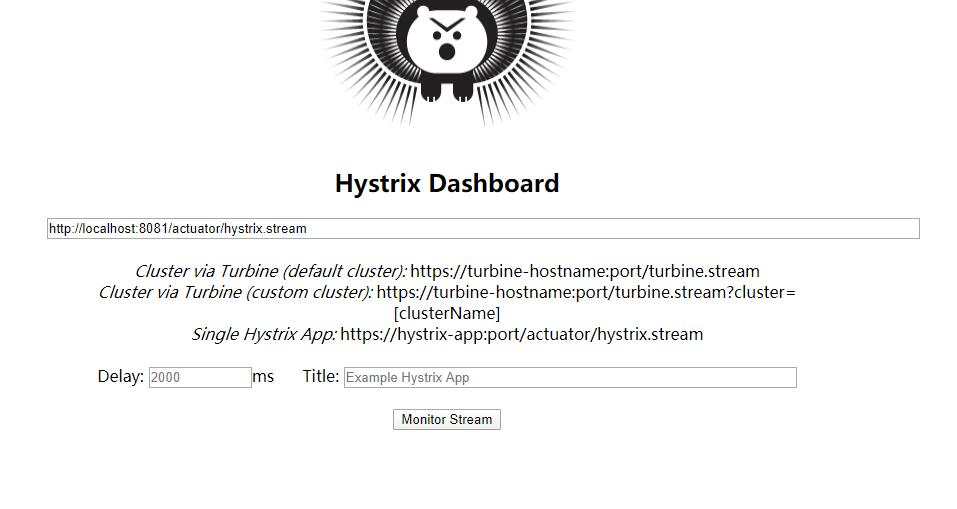

# hystrix
参考 https://baijiahao.baidu.com/s?id=1623004854011062838&wfr=spider&for=pc  
断路器/熔断器  

项目 test 项目作为服务提供者； test1 中声明了 TestFeignClient，
作为服务消费者，调用 test 中的服务。

在 test1/src/main/java/com/xiyuan/cloud/feign/TestFeignClient.java 中添加熔断响应fallback    
 ```java
package com.xiyuan.cloud.feign;

import org.springframework.cloud.openfeign.FeignClient;
import org.springframework.context.annotation.Configuration;
import org.springframework.web.bind.annotation.RequestMapping;

/**
 * Created by xiyuan_fengyu on 2020/3/26 16:57.
 */
@FeignClient(name = "test", fallback = TestFeignClient.Fallback.class)
public interface TestFeignClient {

    @RequestMapping("/test")
    String test();

    @Configuration
    class Fallback implements TestFeignClient {

        @Override
        public String test() {
            return "服务暂不可用，请稍后重试";
        }

    }

}
```

为 test1 项目添加配置(本地bootstrap.yml或者nacos中添加配置)  
```
feign.hystrix.enabled=true
```

启动 test 和 test1，访问 http://localhost:8081/test 能拿到正常结果  
```
Message{id=0, content=null} TestConfig{id=1, name='Tom'}
```  
停止 test，再次访问，得到结果  
```
服务暂不可用，请稍后重试
```  
重启 test 后，片刻之后，访问恢复正常  

# hystrix-dashbord
通过ui界面查看断路器的工作状态  
启动 hystrix/hystrix-dashbord/src/main/java/com/xiyuan/cloud/HystrixDashboardApp.java    
访问 http://localhost:9090/hystrix  
输入 http://localhost:8081/actuator/hystrix.stream   
  
点击 "Monitor Stream" 查看详情  
此时会提示"Unable to connect to Command Metric Stream."    
  
这是因为 test1 还没有引入 actuator  
向 test1 的pom.xml添加依赖  
```
<dependency>
    <groupId>org.springframework.boot</groupId>
    <artifactId>spring-boot-starter-actuator</artifactId>
</dependency>

<dependency>
    <groupId>org.springframework.cloud</groupId>
    <artifactId>spring-cloud-starter-netflix-hystrix</artifactId>
</dependency>
```

在启动类上添加 @EnableCircuitBreaker  
```
@SpringBootApplication
@EnableFeignClients
@EnableCircuitBreaker
public class Test1App {

    public static void main(String[] args) {
        SpringApplication.run(Test1App.class, args);
    }

}
```
且 actuator 相关接口默认不会暴露，需要为 test1 添加配置  
```
management.endpoints.web.exposure.include=hystrix.stream 
```

重启 test1 后，访问  
http://localhost:8081/test  
停止 test，在访问一次  
便可在hystrix-dashbord界面看到  
  
