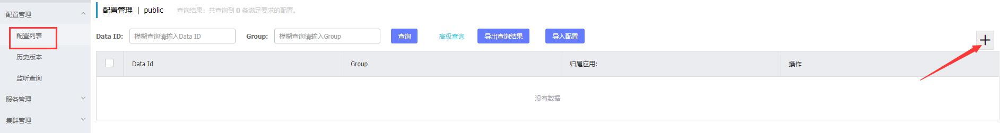
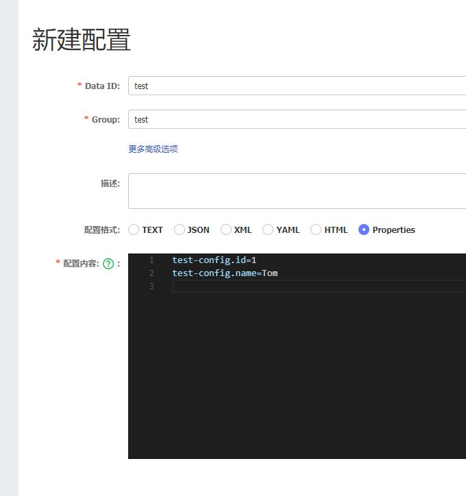

# nacos  
动态服务发现和配置中心  
比 eureka + config server 更加强大  
 
 # 参考  
 https://nacos.io/zh-cn/docs/what-is-nacos.html  
 https://nacos.io/zh-cn/docs/use-nacos-with-springcloud.html  
 https://blog.csdn.net/a718515028/article/details/87857087?depth_1-utm_source=distribute.pc_relevant.none-task&utm_source=distribute.pc_relevant.none-task  

# nacos server 安装     
从 https://github.com/alibaba/nacos/releases 下载 nacos-server-\*.\*.\*.zip  
解压后，在 nacos 目录执行 bin/startup.cmd 启动    
然后浏览器访问 http://localhost:8848/nacos/index.html  

# 作为配置中心使用  
在“配置管理” >> “配置列表” 添加一个测试配置文件  
  

配置内容(spring-cloud + nacos目前只支持properties格式)  
```properties
test-config.id=1
test-config.name=Tom
```
  

在 test 项目中使用配置  
参考 https://github.com/alibaba/spring-cloud-alibaba/blob/master/spring-cloud-alibaba-examples/nacos-example/nacos-config-example/readme.md  
在 test/pom.xml 中添加依赖  
```xml
<dependency>
    <groupId>com.alibaba.cloud</groupId>
    <artifactId>spring-cloud-starter-alibaba-nacos-config</artifactId>
    <version>2.2.0.RELEASE</version>
</dependency>
```
在 test/src/main/resources/bootstrap.yml 添加 nacos 配置  
spring.application.name 对应配置的 Data ID，spring.cloud.nacos.config.group 对应配置的 group    
```yaml
spring:
  application:
    name: test
  cloud:
    nacos:
      config:
        server-addr: 127.0.0.1:8848
        group: test
```
添加配置类  
```java
package com.xiyuan.cloud.config;

import org.springframework.boot.context.properties.ConfigurationProperties;
import org.springframework.context.annotation.Configuration;

/**
 * Created by xiyuan_fengyu on 2020/3/26 15:44.
 */
@Configuration
@ConfigurationProperties(prefix = "test-config")
public class TestConfig {

    private int id;

    private String name;

    public int getId() {
        return id;
    }

    public void setId(int id) {
        this.id = id;
    }

    public String getName() {
        return name;
    }

    public void setName(String name) {
        this.name = name;
    }

    @Override
    public String toString() {
        return "TestConfig{" +
                "id=" + id +
                ", name='" + name + '\'' +
                '}';
    }

}
```
在 TestController 中注入使用  
```java
package com.xiyuan.cloud.controller;

import com.xiyuan.cloud.config.TestConfig;
import org.springframework.beans.factory.annotation.Autowired;
import org.springframework.stereotype.Controller;
import org.springframework.web.bind.annotation.RequestMapping;
import org.springframework.web.bind.annotation.ResponseBody;

/**
 * Created by xiyuan_fengyu on 2020/3/26 15:01.
 */
@Controller
public class TestController {

    @Autowired
    private TestConfig testConfig;

    @ResponseBody
    @RequestMapping("/test")
    public String test() {
        return testConfig.toString();
    }

}
```
运行期间修改配置，属性值会自动刷新  

# 作为服务注册中心使用
参考 https://github.com/alibaba/spring-cloud-alibaba/blob/master/spring-cloud-alibaba-examples/nacos-example/nacos-discovery-example/readme.md  
在 test/pom.xml 中添加依赖  
```xml
<dependency>
    <groupId>com.alibaba.cloud</groupId>
    <artifactId>spring-cloud-starter-alibaba-nacos-discovery</artifactId>
    <version>2.2.0.RELEASE</version>
</dependency>
```
在 test/src/main/resources/bootstrap.yml 添加 nacos 配置  
```yaml
spring:
  application:
    name: test
  cloud:
    nacos:
      config:
        server-addr: 127.0.0.1:8848
        group: test
      discovery:
        server-addr: 127.0.0.1:8848
        group: test
```
启动 test项目后，在 nacos 管理界面能够看到服务列表增加了 test  
   

在项目 test1 中通过 feign client 来调用 test 的服务  

```xml
<dependency>
    <groupId>org.springframework.cloud</groupId>
    <artifactId>spring-cloud-starter-openfeign</artifactId>
    <version>2.2.2.RELEASE</version>
</dependency>
```

```yaml
server:
  port: 8081
spring:
  application:
    name: test1
  cloud:
    nacos:
      config:
        server-addr: 127.0.0.1:8848
        group: test
      discovery:
        server-addr: 127.0.0.1:8848
        group: test
```

```java
package com.xiyuan.cloud.feign;

import org.springframework.cloud.openfeign.FeignClient;
import org.springframework.web.bind.annotation.RequestMapping;

/**
 * Created by xiyuan_fengyu on 2020/3/26 16:57.
 */
@FeignClient(name = "test")
public interface TestFeignClient {

    @RequestMapping("/test")
    String test();

}
```

```java
package com.xiyuan.cloud.controller;

import com.xiyuan.cloud.feign.TestFeignClient;
import org.springframework.beans.factory.annotation.Autowired;
import org.springframework.stereotype.Controller;
import org.springframework.web.bind.annotation.RequestMapping;
import org.springframework.web.bind.annotation.ResponseBody;

/**
 * Created by xiyuan_fengyu on 2020/3/26 15:01.
 */
@Controller
public class TestController {

    @Autowired
    private TestFeignClient testFeignClient;

    @ResponseBody
    @RequestMapping("/test")
    public String test() {
        return testFeignClient.test();
    }

}
```

```java
package com.xiyuan.cloud;

import org.springframework.boot.SpringApplication;
import org.springframework.boot.autoconfigure.SpringBootApplication;
import org.springframework.cloud.openfeign.EnableFeignClients;

/**
 * Created by xiyuan_fengyu on 2020/3/26 14:58.
 */
@SpringBootApplication
@EnableFeignClients
public class App {

    public static void main(String[] args) {
        SpringApplication.run(App.class, args);
    }

}
```
test1 启动后，服务列表会增加一个 test1 服务，访问 http://localhost:8081/test 会得到与 http://localhost:8080/test 一样的结果  

# 集群搭建
参考 http://www.imooc.com/article/288153  
将 nacos-server-1.2.0.zip 解压出两份 nacos-1 和 nacos-2  

首先在mysql中添加数据库(注意：这个版本的nacos需要使用5.7相近的mysql版本，否则可能因为mysql驱动的问题，连接不上；如果本本不对应，可参考 http://www.imooc.com/article/288153 里面的方法解决)    
将 nacos-1/conf/nacos-mysql.sql 复制到服务器上，保存在/root/nacos-mysql.sql    
执行以下语句创建数据库  
```shell script
echo -e '
drop database if exists nacos;
create database nacos;
drop user if exists nacos;
create user nacos@'"'%'"' identified by '"'Qwer_1234'"';
grant all privileges on nacos.* to nacos@'"'%'"' with grant option;
flush privileges;
use nacos;
' > /root/nacos-prepare.sql;
cat /root/nacos-mysql.sql >> /root/nacos-prepare.sql;
mysql -h localhost --port 3306 -uroot -p < /root/nacos-prepare.sql
```  

修改 nacos-1/conf/application.properties，启用mysql    
```properties
### If user MySQL as datasource:
spring.datasource.platform=mysql

### Count of DB:
db.num=1

### Connect URL of DB:
db.url.0=jdbc:mysql://192.168.99.149:3306/nacos?characterEncoding=utf8&connectTimeout=1000&socketTimeout=3000&autoReconnect=true
db.user=nacos
db.password=Qwer_1234
```

修改 nacos-2/conf/application.properties，修改端口，启用mysql    
```properties
### Default web server port:
server.port=8849

### If user MySQL as datasource:
spring.datasource.platform=mysql

### Count of DB:
db.num=1

### Connect URL of DB:
db.url.0=jdbc:mysql://192.168.99.149:3306/nacos?characterEncoding=utf8&connectTimeout=1000&socketTimeout=3000&autoReconnect=true
db.user=nacos
db.password=Qwer_1234
```

修改 nacos-*/conf/cluster.conf，注意ip为局域网ip或外网ip，不能是localhost，127.0.0.1，否则无法成功加入集群      
```
192.168.51.99:8848
192.168.51.99:8849
```  

修改 nacos-*/bin/startup.cmd 中的 MODE  
```
set MODE="cluster"
``` 

然后可以修改 test, test1 两个项目的 bootstrap.xml 的 nacos 配置  
```yaml
spring:
  cloud:
    nacos:
      config:
        server-addr: 127.0.0.1:8848,127.0.0.1:8849
        group: test
      discovery:
        server-addr: 127.0.0.1:8848,127.0.0.1:8849
        group: test
```   


